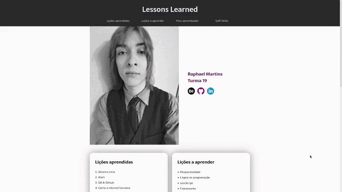
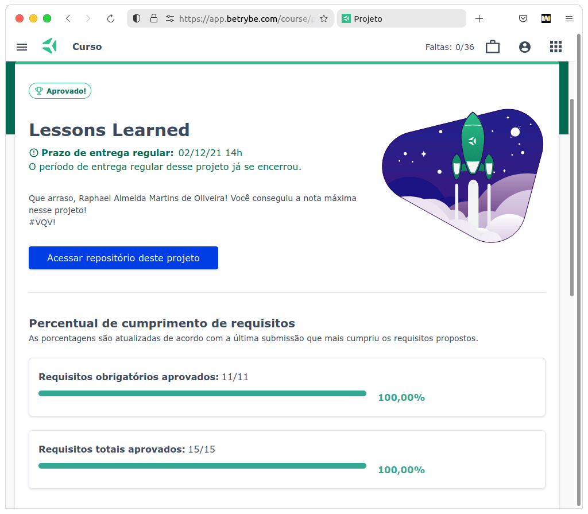

<small>(for the English version, <a href="#en">click here</a>)</small>

# Lessons Learned
<h2>:brazil: Português</h2>

Projeto de HTML & CSS desenvolvido por mim (<a href="https://www.linkedin.com/in/raphaelameidamartins/" target="_blank" rel="external">Raphael Martins</a>) ao final do Bloco 3 do Módulo 1 do curso de Desenvolvimento Web da <a href="https://www.betrybe.com" targe="_blank" rel="nofollow">Trybe</a>. Obtive aprovação com 100% dos requisitos obrigatórios e opcionais atingidos, e seguindo as todas as regras de padronização do código e boas práticas do Linter.

O projeto consistiu no desenvolvimento de uma página web estática utilizando os conhecimentos obtidos nos três primeiros blocos do curso. A página precisava conter uma lista das lições aprendidas durante esse período, uma lista contendo futuros conteúdos e um pequeno artigo descrevendo minha experiência.

<a href="https://raphaelalmeidamartins.github.io/project-lessons-learned/" target="_blank">Clique aqui</a> para conferir o resultado do projeto no navegador.

### Requisitos
<ol>
  <li>Adicione uma cor de fundo específica para a página
  
Possuir cor de fundo: rgb(253, 251, 251)

  </li>
  <li>Adicione uma barra superior com um título
  
A barra deve possuir o ID "cabecalho" e deve ser fixa no topo da página com a propriedade top tendo 0. O título deve estar dentro da barra e ser um elemento h1 com ID "titulo".

  </li>
  <li>Adicione uma foto sua à página
  
A foto deve ser inserida utilizando uma tag img com o ID "minha_foto".

  </li>
  <li>Adicione uma lista de lições aprendidas à página
  
A lista deve possuir 10 itens, ser numerada e possuir o ID "licoes_aprendidas".

  </li>
  <li>Crie uma lista de lições que ainda deseja aprender para a página
  
A lista deve possuir 10 itens, não ser numerada e possuir o ID "licoes_a_aprender".

  </li>
  <li>Adicione um rodapé para a página
  
O rodapé deve utilizar a tag footer e possuir o ID "rodape".

  </li>
  <li>Insira pelo menos um link externo na página
  
A configuração desse link deve ser feita para abrir em uma nova aba do navegador

  </li>
  <li>Crie um artigo sobre seu aprendizado
  
O artigo deverá possuir mais de 300 caracteres e menos de 600, além disto deve possuir a tag article.

  </li>
  <li>Crie uma seção que conta uma passagem sobre seu aprendizado
  
A seção deverá possuir mais de 100 caracteres e menos de 300, além disto deve possuir a tag aside.

  </li>
  <li>Aplique elementos HTML de acordo com o sentido e propósito de cada um deles
  
Para tornar o seu site mais acessível e melhorar seu ranqueamento em mecanismos de busca na Web, sua página deve conter os seguintes elementos: article, header, nav, section, aside e footer.

  </li>
  <li>Teste a semântica da sua página está aprovada pelo site CodeSniffer
  </li>
</ol>

### Bônus
<ol start="12">
  <li>Adicione uma tabela à página</li>
  <li>Utilize o Box model
  
Altere margin, padding e border dos elementos para ver, na prática, como esses atributos influenciam e melhoram a visualização dos componentes.

  </li>
  <li>Altere atributos relacionados as fontes
  
Modifique o estilo da sua tipografia alterando o tamanho de letra, a cor, o espaçamento entre as linhas e a font-family.

  </li>
  <li>Posicione o seu artigo e a seção sobre aprendizados um ao lado do outro
  
Adicione ao elemento posicionado no lado esquerdo a classe "lado-esquerdo" e ao elemento posicionado no lado direito a classe "lado-direito".

  </li>
</ol>
 

<h2 id="en">:us: English</h2>

HTML & CSS project develop by me (<a href="https://www.linkedin.com/in/raphaelameidamartins/" target="_blank" rel="external">Raphael Martins</a>) in the end of the Unit 3 Module 1 of the Web Development course at <a href="https://www.betrybe.com" targe="_blank" rel="nofollow">Trybe</a>. I was approved with 100% of the mandatory and optional requirements met, and following all the Linter rules of best practices and code standardization.

We had to develop a static web page using the knowledge acquired in the first three units of the course. The page needed to have a list of the lessons learned during this period, a list of future contents I am still going to learn, and a brief article describing my experience.

<a href="https://raphaelalmeidamartins.github.io/project-lessons-learned/" target="_blank">Click here</a> to check out the final version of the project on your browser.

### Requirements
<ol>
  <li>Add a specific background color to your page
  
The background color must be: rgb(253, 251, 251)

  </li>
  <li>Add a header with a title
  
The header needs to have "cabecalho" as the ID, and needs to be fixed on the top of the page with 0 in the top property. The title needs to be a h1 element, to be inside the header and to have "titulo" as the ID.

  </li>
  <li>Add a photo to your page
  
The photo needs to have "minha_foto" and the ID, and to be an img element.

  </li>
  <li>Add a list of lessons learned to your page
  
It needs to have 10 items, to be numbered and to have "licoes_aprendidas" as the ID.

  </li>
  <li>Create another list with lessons you still are going to learn
  
It needs to have 10 items, to not be numbered and to have "licoes_a_aprender" as the ID.

  </li>
  <li>Add a footer to your page
  
It needs to use the tag footer and to have "rodape" as the ID.

  </li>
  <li>Add at least one external link to your page
  
The link needs to open on a blank tab.

  </li>
  <li>Create a small article about your learning
  
The article should have more than 300 characters and less than 600. It also needs to have the tag article.

  </li>
  <li>Add a small section containing a small passage about your learning
  
It should have more than 100 characters and less than 300. It also needs to have the tag aside.

  </li>
  <li>Apply HTML tag according to the semantics of every element in your page
  
In other to improve the accessibility and ranking of your page on search engines, it needs to have the following tags: article, header, nav, section, aside e footer.

  </li>
  <li>Test if the semantics of your page is approved by the site CodeSniffer</li>
</ol>

### Bonus
<ol start="12">
  <li>Add a table to your page</li>
  <li>Use the Box model
  
Change the margin, the padding and the border of the elements to see how these properties can influence and improve the layout.

  </li>
  <li>Change font properties
  
Change font-family, font-style, font-size, color, and line-height.

  </li>
  <li>Position your article and the small section side by side
  
Add the class "lado-esquerdo" to the element on the left, and the class "lado-direito" to the element on the right.

  </li>
</ol>
